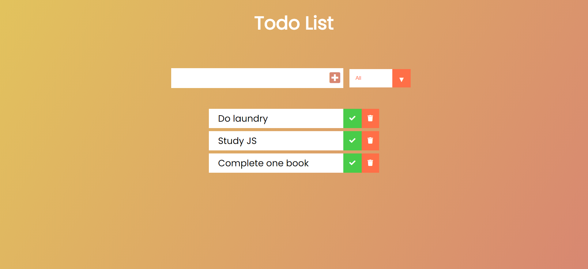
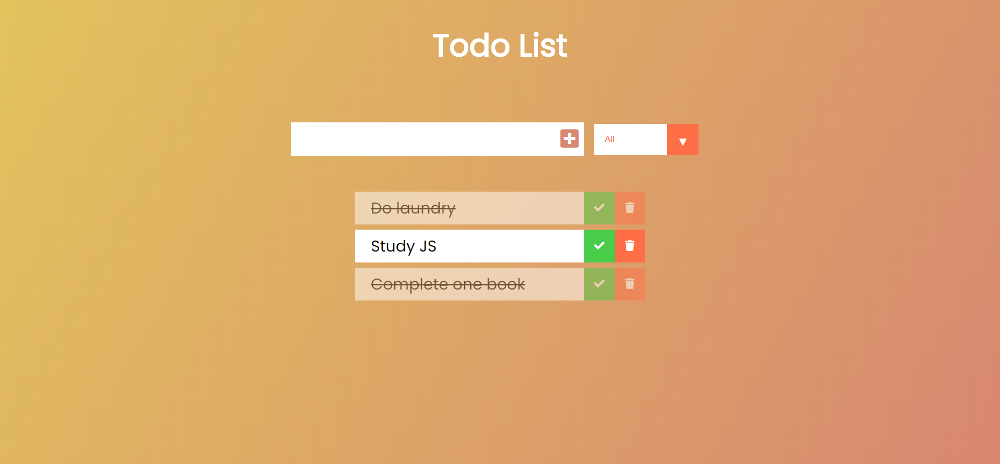
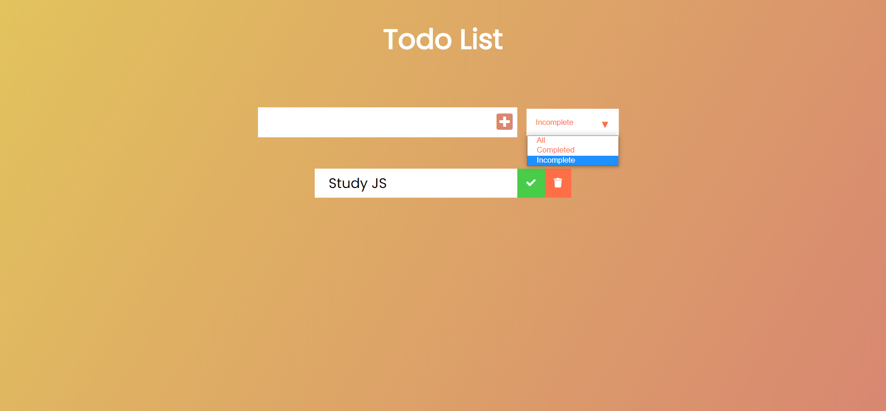
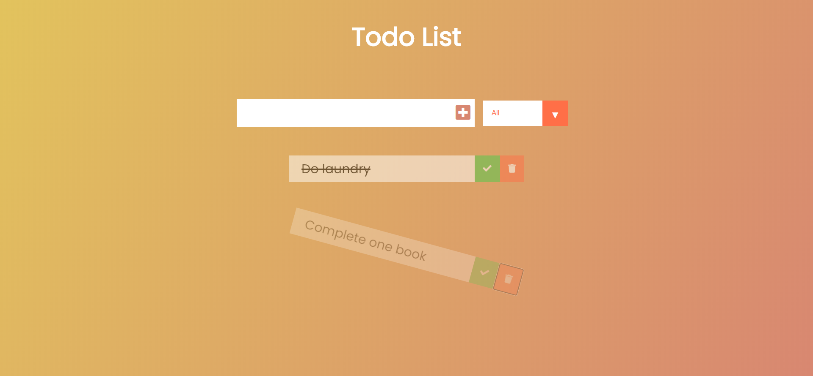

# About the Project

A basic Todo application built using HTML, CSS and JS. User can create, delete, mark as complete and filter the todo items

# Technologies Used

- [HTML5](https://developer.mozilla.org/en-US/docs/Web/Guide/HTML/HTML5)
- [CSS3](https://developer.mozilla.org/en-US/docs/Archive/CSS3)
- [JavaScript](https://www.javascript.com/)

# Screenshots

